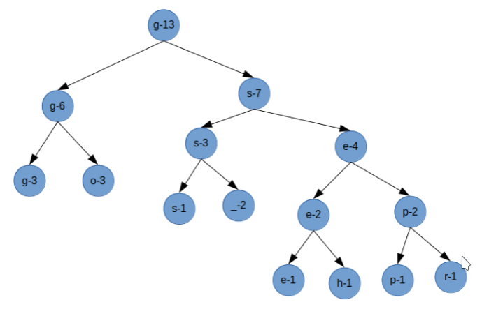

# Huffman

## Background

Huffman encoding is a technique for compressing files to save space on storage devices. The general idea is to build a full binary tree whose leaves represent the unique characters of the file and whose branches represent the bits of the code. On sufficiently large files, the technique will result in a net reduction in the number of bytes required to store the information.

Suppose a text file conains a string

```
go go gophers
```

which is a 13-character (104-bit) sequence with the character distribution as
```
'e': 1, 'g': 3, 'h': 1, 'o': 3, 'p': 1, 'r': 1, 's': 1, ' ': 2
```

We build a Huffman tree is by creating a leaf for each unique character. Repeatedly, we form a tree by combining nodes with the smallest counts, until only one node remains. The last node is the root of the entire tree. Below is a tree generated from our example:



Given the tree, we can encode the original file using 37 bits as follows:

```
Original: go go gophers
Encoding: g(00)o(01) (101)g(00)o(01) (101)g(00)o(01)p(1110)h(1101)e(1100)r(1111)s(100)
Resulted: 000110100011010001111011011100111110.
```

If we split the resulted bit-string into group of 8 — padding the last group if needed — we can encode the content of the file with just 5 bytes. Namely,

1. 00011010 (0x1a, unprintable)
2. 00110100 (0x34, '4')
3. 01111011 (0x7b, '{')
4. 01110011 (0x73, 's')
5. 11100000 (0xe0, unprintable)

Note that some overhead will also be required. We will need to store the file length and the tree. We may use the ordinary characters to create a tree representation. For example, a preorder traversal may be written as `I`*tree<sub>1</sub>tree<sub>2</sub>* for internal nodes and `L`*ch* for leaves. The tree shown above would be written as

```
IILgLoIILsL IILeLhILpLr
```

Note that, after the tree is built, the distribution of characters used to built the tree is no longer matter.

On sufficiently large files, the technique of Huffman encoding will result in a net reduction in the number of bytes required to store the information.

## Approach

We will build a program that can perform compression on a file and decompress a Huffman-compressed file using the knowledge of Huffman tree. Two binaries will be created. The `compress` binary will takes a file, encodes it using Huffman encoding, and writes the result to standard output. We may redirect that standard output to a file as following:

```
./compress source.txt > source.txt.z
```

The `uncompress` binary reverses the process. It takes the encoded data from standard input, decodes it, and writes the result to standard output. We may redirect the standard input and output as following:

```
./uncompress < source.txt.z > copy_of_source.txt
```

If it is done correctly, given a large file, the encoded file should be smaller than the original file and the decoded file will produce exactly the same as the original. If it is *really* done correctly, we may sometimes encode twice to get it even smaller.

The basic algorithms for `compress` and `decompress` followed:

`compress`:

1. Read the original file data
2. Generate a sorted character distribution: a priority queue of trees sorted by tree weight.
3. Build a Huffman tree. Store codes for each character in a separate array of strings.
4. Write the overhead (source file length and tree) to the standard output
5. Read the original file a second time, generating bits for each source character. When you have at least 8 bits, remove them, convert them to a character, and write to standard output.
6. If you have any leftover bits, pad to a multiple of 8 bits, generate, and write the character.

`uncompress`:

1. Read the overhead from the standard input
2. Start at the root of the tree,
3. Read bits, 8 at a time from the standard input. Use each bit to move from an internal node toward a leaf (0-left, 1-right).
4. When you reach a leaf, output the character. Stop when you’ve output the correct number of characters, otherwise, go back to step 2.

To streamline and improve the accuracy of Huffman-tree building process during compression, we employ Min-Heap as an underlying data structure of the Huffman tree. To be even more adventurous, using the data structure of linked-list, we build a priority queue to facilitate the internal operations needed to create and maintain a Min-Heap.

## How to run

To create the `compress` and `decompress` binaries, using the given *Makefile* and within the same directory, execute:

```
ls Makefile
make
```

To run compression:

```
builds/compress source.txt > source.txt.z
```

To run decompression:

```
builds/uncompress < source.txt.z > copy_of_source.txt
```

## Author

Truong Pham